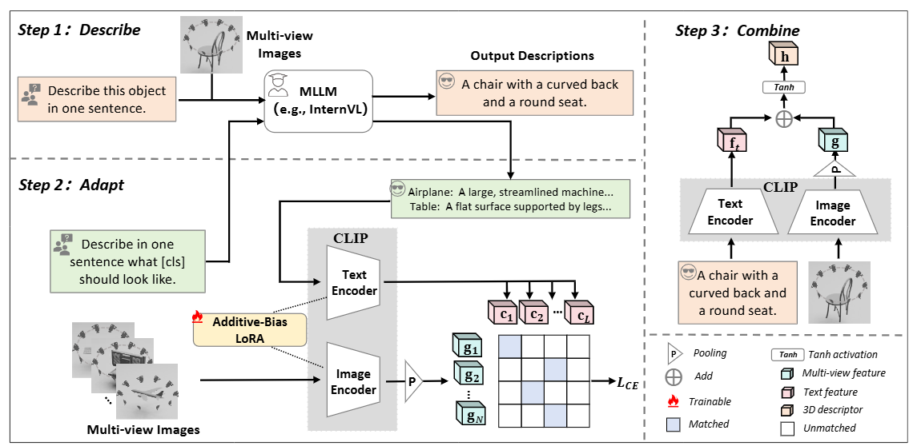

<div align="center">
<h1>Describe, Adapt and Combine: Empowering CLIP Encoders for Open-set 3D Object Retrieval</h1>
  
**Zhichuan Wang**<sup>1</sup> · **Yang Zhou**<sup>2</sup> · **Zhe Liu**<sup>3</sup> · **Rui Yu**<sup>4</sup> · **Song Bai**<sup>5</sup>  
**Yulong Wang**<sup>1*</sup> · **Xinwei He**<sup>1*</sup> · **Xiang Bai**<sup>6</sup>  

<sup>1</sup>Huazhong Agricultural University  <sup>2</sup>Shenzhen University  <sup>3</sup>The University of Hong Kong  
<sup>4</sup>University of Louisville  <sup>5</sup>ByteDance  <sup>6</sup>Huazhong University of Science and Technology  

**ICCV 2025**

<!-- **[[Paper](https://arxiv.org/abs/2412.09442)]** -->

</div>


<hr/>

## Abstract
*Open-set 3D object retrieval (3DOR) is an emerging task aiming to retrieve 3D objects of unseen categories beyond the training set. Existing methods typically utilize all modalities (i.e., voxels, point clouds, multi-view images) and train specific backbones before fusion. However, they still struggle to produce generalized representations due to insufficient 3D training data. Being contrastively pre-trained on web-scale image-text pairs, CLIP inherently produces generalized representations for a wide range of downstream tasks. Building upon it, we present a simple yet effective framework named Describe, Adapt and Combine (DAC) by taking only multi-view images for open-set 3DOR. DAC innovatively synergizes a CLIP model with a multi-modal large language model (MLLM) to learn generalized 3D representations, where the MLLM is used for dual purposes. First, it describes the seen category information to align with CLIP's training objective for adaptation during training. Second, it provides external hints about unknown objects complementary to visual cues during inference. To improve the synergy, we introduce an Additive-Bias Low-Rank adaptation (AB-LoRA), which alleviates overfitting and further enhances the generalization to unseen categories. With only multi-view images, DAC significantly surpasses prior arts by an average of +10.01\% mAP on four open-set 3DOR datasets. Moreover, its generalization is also validated on image-based and cross-dataset setups.*



## Data Preparation

To download the four datasets (OS-ESB-core, OS-NTU-core, OS-MN40-core, and OS-ABO-core) for the Open-Set Retrieval task, please refer to [HGM2R](https://github.com/iMoonLab/HGM2R/tree/main). To download the Objaverse dataset, please refer to [OpenShape](https://github.com/Colin97/OpenShape_code).


## 📄 Requirement

* Setup conda environment.
```bash
# Create a conda environment
conda create -y -n dac python=3.9

# Activate the environment
conda activate dac
```

* Clone DAC code repository and install requirements
```bash
git clone https://github.com/wangzhichuan123/DAC.git

cd DAC/

# Install requirements
pip install -r requirements.txt
```

## 🚀 Running

Run bash scripts/run.sh [dataset] [backbone] [rank] [gpu_id] to run DAC, e.g.

```
bash scripts/run.sh esb ViT-B/32 8 0
```

If you have already extracted and saved the features, you can use the following command to directly test DAC :

```
python test.py --dataset esb --backbone ViT-B/32 --r 8
```

## ⭐ Citation
Thanks for citing our paper.